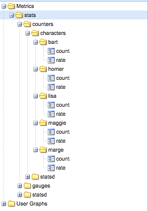

# graphite-scaling-examples

This project contains examples of scaling [Graphite](https://github.com/graphite-project/). It uses [Docker Compose](https://docs.docker.com/compose/) to let you easily spin-up and play around with different Graphite configurations.

The examples are all based on the configurations described in Chapter 8 of [Monitoring with Graphite](http://shop.oreilly.com/product/0636920035794.do), which is an excellent resource for learning about scaling Graphite.

## Running the examples

All of the examples use common Docker images for Graphite and StatsD. Before running any of the examples, you'll need to build these images locally.

To do this, you can just run:

```
make
```

You can then `cd` into one of the example directories and run:

```
cd examples/multiple-cache-nodes
docker-compose up
```

The examples all expose a StatsD server and Graphite Web application on the same local ports (8125 and 8080 respectively), so you'll need to stop any running containers when moving from one example to another:

```
docker-compose stop
```

You can use the [`stats.sh`](stats.sh) script to send some metrics to StatsD.

```
sh stats.sh
```

These should appear in the Graphite UI at [http://127.0.0.1:8080](http://127.0.0.1:8080):



You can verify how they've been sharded by examining the whisper files on one of your carbon cache containers. The example shows how the metrics are sharded for the [`multiple-cache-nodes`](examples/multiple-cache-nodes) example, where two backend carbon cache nodes are used.

```bash
docker-compose exec cache_1 tree /opt/graphite/storage/whisper/stats/counters/characters
# /opt/graphite/storage/whisper/stats/counters/characters
# |-- maggie
# |   `-- count.wsp
# |-- lisa
# |   |-- rate.wsp
# |   `-- count.wsp
# |-- homer
# |   `-- count.wsp
# `-- bart
#     |-- rate.wsp
#     `-- count.wsp
#
# 4 directories, 6 files
```

```bash
docker-compose exec cache_2 tree /opt/graphite/storage/whisper/stats/counters/characters
# /opt/graphite/storage/whisper/stats/counters/characters
# |-- marge
# |   |-- rate.wsp
# |   `-- count.wsp
# |-- maggie
# |   `-- rate.wsp
# `-- homer
#     `-- rate.wsp
#
# 3 directories, 4 files
```

## The examples

* [`multiple-cache-nodes`](examples/multiple-cache-nodes)

## Reading list

* [Monitoring with Graphite](http://shop.oreilly.com/product/0636920035794.do) (_Chapter 8_)
