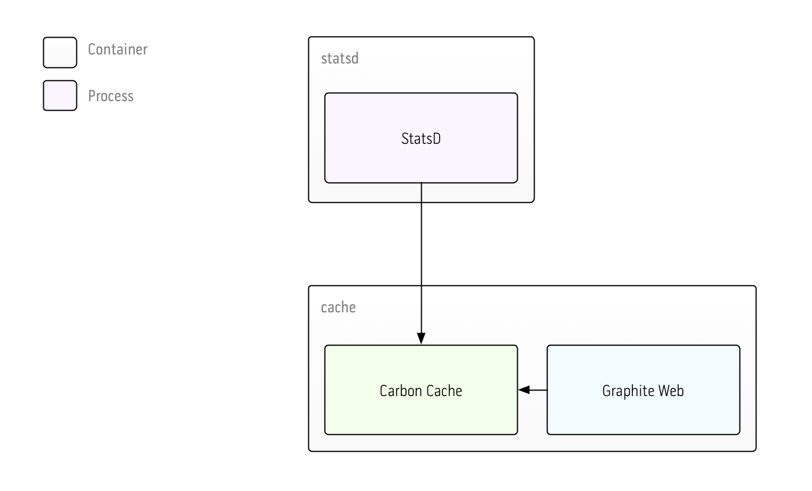

# single-node

This example uses a single node running Carbon cache and Graphite Web. This is the simplest Graphite setup, and one that most people start with when deploying Graphite for the first time.

