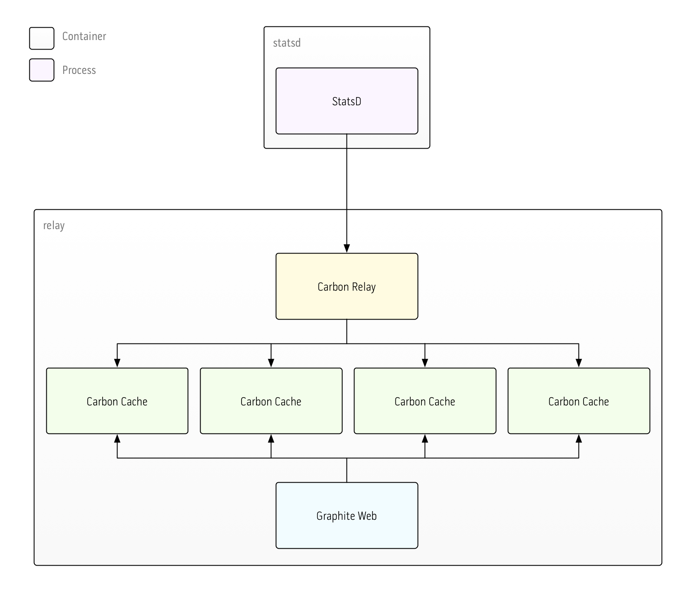

# single-relay

This example uses a single node running a Carbon relay process and a pool of Carbon cache processes. Carbon relay receives metrics from StatsD and, using Graphite's `consistent-hashing` method, shards metrics between the four backend Carbon cache processes. Graphite Web is configured to retrieve metrics from the four cache processes using the same hashing mechanism.

